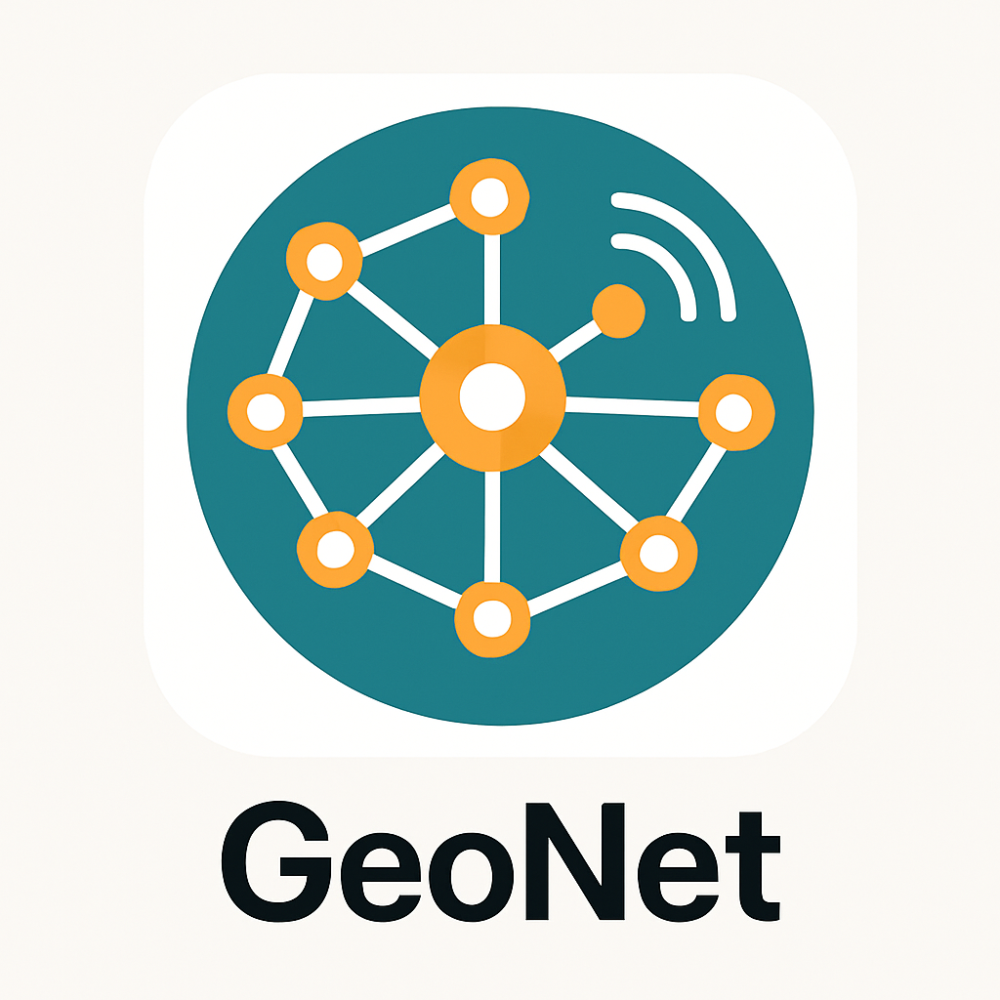
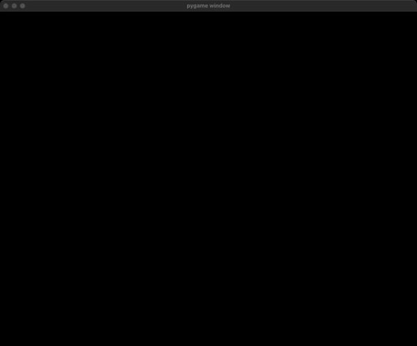

# GeoNet
<p align="center">
  
</p>

A Python-based sensor network simulation framework with real-time visualization capabilities. GeoNet allows you to create, simulate, and visualize sensor networks with various connection topologies and communication patterns.

## Table of Contents

- [GeoNet](#geonet)
  - [Table of Contents](#table-of-contents)
  - [Features](#features)
  - [Installation](#installation)
    - [Dependencies](#dependencies)
  - [Quick Start](#quick-start)
    - [Basic Network Example](#basic-network-example)
  - [Examples](#examples)
    - [Basic Examples](#basic-examples)
    - [Advanced Examples](#advanced-examples)
    - [Demonstrations](#demonstrations)
  - [Architecture](#architecture)
    - [Core Components](#core-components)
      - [Engine (`/src/engine/`)](#engine-srcengine)
      - [Sensors (`/src/components/sensors/`)](#sensors-srccomponentssensors)
      - [Components (`/src/components/`)](#components-srccomponents)
    - [Connection Types](#connection-types)
  - [Configuration](#configuration)
  - [Interactive Controls](#interactive-controls)
  - [Sensor Programming](#sensor-programming)
    - [Creating Sensors](#creating-sensors)
    - [Sensor Communication](#sensor-communication)
    - [Connection Patterns](#connection-patterns)
  - [Development](#development)
    - [Code Style](#code-style)
    - [Project Structure](#project-structure)
  - [Contributing](#contributing)
  - [License](#license)
  - [Research Applications](#research-applications)
  - [Support](#support)

## Features

- **Real-time Visualization**: Interactive pygame-based visualization of sensor networks
- **Multiple Connection Types**: Support for Unit Disk Graph (UDG), Gabriel Graph (GG), and custom connection patterns
- **Event-driven Simulation**: Sensors can transmit data, change states, and respond to events
- **Configurable Parameters**: Customizable grid size, update intervals, display settings, and more
- **Interactive Controls**: Click on sensors to inspect their state
- **Extensible Architecture**: Easy to add new sensor behaviors and connection algorithms

## Installation

1. Clone this repository:
   ```bash
   git clone https://github.com/DayVil/geonet.git
   cd geonet
   ```

2. Install dependencies using UV (recommended):
   ```bash
   uv sync
   ```

3. Activate the virtual environment:
   ```bash
   source .venv/bin/activate
   ```

4. Install pre-commit hooks for development:
   ```bash
   uv run pre-commit install
   ```

### Dependencies

- **pygame**: For graphics and visualization
- **networkx**: For graph algorithms and network analysis
- **icecream**: For debugging utilities

## Quick Start

### Basic Network Example

```python
from src.engine.geonet import GeoNetEngine, GeoNetConfig
from src.components.sensors.sensor import create_sensors
from src.engine.geo_color import Color

def on_receive(sensor, values):
    """Called when a sensor receives data"""
    if sensor.state["active"]:
        return
    sensor.color = Color.GREEN
    sensor.broadcast(values)

def setup(manager, patches, global_state):
    """Initialize the simulation"""
    sensors = create_sensors(
        amount=20,
        grid=patches,
        initial_state={"active": False},
        on_receive=on_receive
    )
    manager.append_multiple_sensors(sensors)
    manager.connect_sensors_chain(sensors)
    
    # Start transmission from first sensor
    sensors[0].transmit(sensors[0], [1.0])

# Run the simulation
engine = GeoNetEngine(GeoNetConfig(window_title="My Network"))
engine.main_loop(setup_fn=setup)
```

## Examples

The `/examples` directory contains several demonstration scenarios:

### Basic Examples

- **`hello_network.py`**: Simple chain and star network connectivity
- **`using_udg.py`**: Unit Disk Graph connections with auto-tuning
- **`using_gg.py`**: Gabriel Graph connections

### Advanced Examples

- **`boundary_estimation/`**: Complex scenarios for boundary detection algorithms
  - `static_rain.py`: Static environmental sensing
  - `dynamic_rain.py`: Dynamic environmental changes

Run examples with:
```bash
python -m examples.hello_network
python -m examples.using_udg
python -m examples.using_gg
python -m examples.boundary_estimation
```

### Demonstrations

Watch GeoNet in action with these example demonstrations:


*Basic network connectivity and communication patterns*


*Advanced boundary detection algorithms in sensor networks*

## Architecture

### Core Components

#### Engine (`/src/engine/`)
- **`geonet.py`**: Main simulation engine and pygame integration
- **`grid.py`**: Grid system for sensor positioning
- **`geo_color.py`**: Color management for visualization

#### Sensors (`/src/components/sensors/`)
- **`sensor.py`**: Core sensor class with communication capabilities
- **`sensor_manager.py`**: Management and coordination of multiple sensors
- **`sensor_connection_utils.py`**: Algorithms for sensor network topologies
- **`sensor_math.py`**: Mathematical utilities for sensor operations

#### Components (`/src/components/`)
- **`coordinates.py`**: Coordinate system utilities

### Connection Types

GeoNet supports several network topology algorithms:

- **Unit Disk Graph (UDG)**: Sensors connect if within a certain distance
- **Gabriel Graph (GG)**: Geometric graph where connections don't cross other sensors
- **Chain/Star**: Simple sequential or hub-based connections
- **Custom**: Define your own connection logic

## Configuration

Customize your simulation with `GeoNetConfig`:

```python
from src.engine.geonet import GeoNetConfig, GeoNetEngine

config = GeoNetConfig(
    screen_width=1200,      # Window width
    screen_height=900,      # Window height
    window_title="My Sim",  # Window title
    grid_size=60,           # Grid cells per side
    grid_margin=20,         # Margin around grid
    fps=60,                 # Display frame rate
    update_interval=500     # Simulation update interval (ms)
)

engine = GeoNetEngine(config)
```

## Interactive Controls

- **Mouse Click**: Click on sensors to inspect their state in the console
- **ESC Key**: Exit the simulation
- **Window Close**: Standard window controls

## Sensor Programming

### Creating Sensors

```python
from src.components.sensors.sensor import create_sensors

sensors = create_sensors(
    amount=50,                    # Number of sensors
    grid=patches,                 # Grid system
    initial_state={"data": 0},    # Initial sensor state
    on_receive=my_receive_handler # Event handler function
)
```

### Sensor Communication

```python
def on_receive(sensor, values):
    # Process received data
    if not sensor.state.get("processed"):
        sensor.state["processed"] = True
        sensor.color = Color.BLUE
        
        # Forward to neighbors
        for neighbor in sensor.neighbours:
            sensor.transmit(neighbor, values)
            
        # Or broadcast to all neighbors
        sensor.broadcast(values)
```

### Connection Patterns

```python
from src.components.sensors.sensor_connection_utils import (
    udg_connection, 
    gg_connection,
    udg_connection_autotune
)

# Unit Disk Graph with fixed radius
manager.connect_sensors_if(sensors, udg_connection(radius=10))

# Gabriel Graph
manager.connect_sensors_if(sensors, gg_connection(sensors))

# Auto-tuned UDG for connectivity
manager.connect_sensors_if(sensors, udg_connection_autotune(manager, sensors))
```

## Development

### Code Style

The project uses Ruff for linting and formatting:

```bash
# Format code
uv run ruff format

# Run linter
uv run ruff check
```

### Project Structure

```
geonet/
├── src/
│   ├── engine/           # Core simulation engine
│   └── components/       # Sensor and coordinate components
├── examples/             # Example simulations
├── docs/                 # Documentation
└── pyproject.toml        # Project configuration
```

## Contributing

1. Fork the repository
2. Create a feature branch
3. Make your changes
4. Ensure code passes linting: `uv run ruff check`
5. Submit a pull request

## License

The license can be located in the [LICENSE](LICENSE) file.

## Research Applications

GeoNet is designed for research in:
- Sensor network algorithms
- Distributed computing protocols
- Network topology analysis
- Environmental monitoring simulations
- Communication pattern studies

## Support

For questions, issues, or contributions, please [open an issue](link-to-issues).
